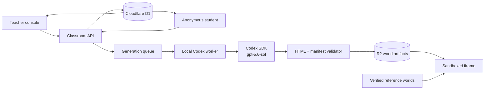

# CounterWorlds

**Turn wrong answers into playable universes.**

CounterWorlds is a live classroom experience for grades 9–12. A teacher collects short explanations, GPT-5.6 Sol clusters the class's mental models through the Codex SDK, and the system compiles a split-screen experiment: one world obeys the misconception, while the other obeys the accepted model. Students predict, manipulate both worlds, gather evidence, and revise their own law before the reveal.

This repository is the runnable hackathon build for the [OpenAI Open Model Hackathon education track](https://openai.devpost.com/).

## Try the demo

1. Start the app and open `http://localhost:3003` (or the port printed by vinext).
2. Choose **Teacher demo**, or open `/teacher/ORBIT7`.
3. In a private/incognito window, open `/join/ORBIT7`.
4. Submit a student belief, compile the CounterWorld, launch it, lock a prediction, reveal the evidence, and revise the belief.
5. Use **Reset demo** in the teacher console to return ORBIT7 to its starting state.

All three judge-friendly reference worlds are always available:

- `/showcase/physics` — force, mass, and acceleration
- `/showcase/mathematics` — horizontal function transformations
- `/showcase/chemistry` — catalysts and equilibrium

## Architecture



The web application is React 19 + TypeScript on Next/vinext and deploys through OpenAI Sites to Cloudflare Workers. D1 stores classroom state; R2 stores validated generated worlds. Classroom updates use short polling at 1.8 seconds, keeping the observable loop inside the two-second target without introducing another service.

## Local setup

Requirements: Node.js 22.13 or newer and a Codex/ChatGPT sign-in that can use GPT-5.6 Sol.

```bash
npm install
npm run dev
```

The starter provisions local D1 and R2 bindings from [`.openai/hosting.json`](.openai/hosting.json). The ORBIT7 classroom and its anonymized sample beliefs seed on first use.

Run checks with:

```bash
npm run test:unit
npx tsc --noEmit
npm run build
```

Generate SQL migrations after schema changes with `npm run db:generate`.

## Live GPT-5.6 Sol generation

Copy `.env.example` to `.env.local` or export the values in your shell:

```text
COUNTERWORLDS_BASE_URL=http://localhost:3003
COUNTERWORLDS_WORKER_TOKEN=replace-with-the-same-secret-used-by-the-site
```

Then run:

```bash
npm run worker:codex
```

[`scripts/codex-worker.ts`](scripts/codex-worker.ts) polls for queued jobs and starts a Codex SDK thread with the explicit `gpt-5.6-sol` model. The prompt treats student text as untrusted data and asks Codex to write only `manifest.json` and `world.html` in a temporary workspace. The worker validates both files, uploads the verified artifact, and marks the session ready. If the local worker is absent, generation fails, or the time budget expires, the app publishes the closest verified reference world.

The worker contract includes:

- misconception clusters and anonymized response mappings;
- two unlabeled panels with identical controls;
- a prediction prompt, evidence explanation, reveal, and reflection;
- deterministic behavioral verification cases;
- no external packages or network-dependent assets.

## Security and privacy

- Students join with generated aliases; no name, email, account, or sensitive educational record is requested.
- Every anonymous membership receives a random bearer token. Student writes are resolved from that token rather than a client-supplied alias.
- Student reads contain only that member's response, prediction, and revision. Aggregate response text and revision trails require the teacher token.
- The canonical explanation is withheld from student API responses until reveal.
- Teacher tokens stay in session storage. The generation-worker secret stays server-side/local and is never shipped to browser code.
- Student text is delimited as untrusted content in the Codex prompt; attempts to override the generation contract are data, not instructions.
- Generated HTML is rejected if it contains external resources, network calls, navigation, browser storage, parent-window access, dynamic code evaluation, or unauthorized browser APIs.
- Validated worlds receive a restrictive content security policy and run inside `sandbox="allow-scripts"` with no same-origin capability.
- The public experience works without the worker because the three reference worlds are bundled and verified.

The hard-coded `demo-teacher-token` is scoped only to the resettable ORBIT7 sample. Teacher tokens for newly created classrooms are random.

## Key files

- [`components/CounterWorldsApp.tsx`](components/CounterWorldsApp.tsx) — teacher, student, landing, and showcase flows
- [`components/WorldLab.tsx`](components/WorldLab.tsx) — synchronized split-screen experiments
- [`lib/counterworlds.ts`](lib/counterworlds.ts) — shared schemas, reference manifests, and clustering
- [`lib/classroom-store.ts`](lib/classroom-store.ts) — D1 persistence and authorization
- [`lib/world-validator.ts`](lib/world-validator.ts) — generated-world security boundary
- [`scripts/codex-worker.ts`](scripts/codex-worker.ts) — Codex SDK generation worker
- [`tests/counterworlds.test.ts`](tests/counterworlds.test.ts) — schemas, clusters, validation, and adversarial inputs

## Three-minute submission video

Suggested cut:

1. **0:00–0:20 — Thesis.** “AI tutors give answers. CounterWorlds makes beliefs testable.”
2. **0:20–0:50 — Capture.** Teacher question; rapid anonymous student explanations.
3. **0:50–1:15 — Compile.** Misconception constellation and GPT-5.6 Sol/Codex generation stages.
4. **1:15–2:00 — Experiment.** Student predicts, changes shared controls, compares worlds, and sees the reveal.
5. **2:00–2:25 — Revision.** Student rewrites the law; teacher sees before/after conceptual change.
6. **2:25–2:50 — Generality.** Fast cuts through physics, mathematics, and chemistry.
7. **2:50–3:00 — Close.** “Don't correct the wrong answer. Build its universe.”

## Hackathon notes

- Primary Codex `/feedback` task: record the final task/session ID in the Devpost submission after this build task is complete.
- The hosted site deliberately keeps the local generation worker optional so judges can explore every core interaction without credentials.
- Scope excludes LMS integration, grading, voice/image input, and production school administration.
- Challenge references: [brief](https://openai.devpost.com/), [FAQ](https://openai.devpost.com/details/faqs), and [GPT-5.6 Sol model documentation](https://developers.openai.com/api/docs/models/gpt-5.6-sol).

## License

Hackathon prototype. Add the license you want before distributing it beyond the event.
