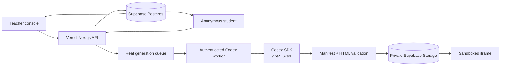

# CounterWorlds

**Turn wrong answers into playable universes.**

CounterWorlds is a live classroom experience for grades 9–12. A teacher collects real student explanations, GPT-5.6 Sol clusters those mental models through the Codex SDK, and the system compiles a class-specific split-screen experiment. Students predict, manipulate both worlds, gather evidence, and revise their own law after the teacher-controlled reveal.

Live deployment: [counter-worlds-uo4l.vercel.app](https://counter-worlds-uo4l.vercel.app)

## Real-data guarantee

CounterWorlds does not ship a seeded classroom, canned student answers, heuristic misconception labels, simulated generation progress, or cached fallback worlds.

- Every classroom is created by a teacher and starts empty.
- Every response, prediction, and revision comes from an anonymous participant who joined that classroom code.
- Every misconception cluster and response mapping is produced by GPT-5.6 Sol from that classroom's submitted explanations.
- Every playable world is generated for that session, validated, uploaded to private Supabase Storage, and then published.
- If generation fails or the authenticated worker is offline, the UI reports that state. It does not substitute synthetic content.

## Live classroom flow

1. Open the deployment and create a classroom.
2. Copy the generated six-character code.
3. Open `/join/CODE` in one or more separate browser contexts.
4. Submit actual student explanations.
5. Close submissions and compile the CounterWorld.
6. Keep the authenticated local Codex worker running while generation completes.
7. Launch the world, record predictions, reveal the evidence, and collect revisions.

## Architecture



The application is React 19 + TypeScript on standard Next.js and deploys to Vercel. Supabase Postgres stores live classroom state. A private Supabase Storage bucket stores only validated generated artifacts. The classroom refresh interval is 1.8 seconds.

## Supabase setup

Apply both migrations in order:

1. [`supabase/migrations/20260718170000_counterworlds.sql`](supabase/migrations/20260718170000_counterworlds.sql)
2. [`supabase/migrations/20260718193000_real_data_only.sql`](supabase/migrations/20260718193000_real_data_only.sql)

The first creates the tables, indexes, authorization boundaries, and private Storage bucket. The second removes the original seeded development session and disallows fallback generation states.

All tables deny direct `anon` and `authenticated` access. The Next.js API uses the service role on the server and verifies teacher/student bearer tokens before returning scoped data.

Configure `.env.local`:

```text
NEXT_PUBLIC_SUPABASE_URL=https://your-project.supabase.co
NEXT_PUBLIC_SUPABASE_PUBLISHABLE_KEY=your-publishable-key
SUPABASE_SERVICE_ROLE_KEY=your-service-role-key
COUNTERWORLDS_WORKER_TOKEN=a-long-random-secret
COUNTERWORLDS_BASE_URL=http://localhost:3000
```

Never expose or commit `SUPABASE_SERVICE_ROLE_KEY` or `COUNTERWORLDS_WORKER_TOKEN`.

## Local development

Requirements: Node.js 22.13 or newer, a configured Supabase project, and a Codex/ChatGPT sign-in that can use GPT-5.6 Sol.

```bash
npm install
npm run dev
```

Run checks with:

```bash
npm run test:unit
npx tsc --noEmit
npm run lint
npm run build
```

## Vercel deployment

Import `AdarshSingh-ASR/CounterWorlds` into Vercel and configure:

- `NEXT_PUBLIC_SUPABASE_URL`
- `NEXT_PUBLIC_SUPABASE_PUBLISHABLE_KEY`
- `SUPABASE_SERVICE_ROLE_KEY`
- `COUNTERWORLDS_WORKER_TOKEN`

Every push to `main` produces a production deployment.

## Live GPT-5.6 Sol generation

Set `COUNTERWORLDS_BASE_URL` to the local or deployed application and use the same `COUNTERWORLDS_WORKER_TOKEN` configured in Vercel, then run:

```bash
npm run worker:codex
```

[`scripts/codex-worker.ts`](scripts/codex-worker.ts) polls real queued jobs and starts a Codex SDK thread with the explicit `gpt-5.6-sol` model. Student text is treated as untrusted data. Codex writes only `manifest.json` and `world.html` in a temporary workspace. The worker verifies that every submitted alias appears in exactly one generated cluster, validates the HTML security contract, and uploads the resulting artifact. A failure remains a visible failure and can be retried.

## Security and privacy

- Students receive generated aliases; no name, email, account, or sensitive educational record is requested.
- Each membership receives a random bearer token. Writes are resolved from that token rather than a client-supplied alias.
- Student reads contain only that member's response, prediction, and revision. Aggregate evidence requires the teacher token.
- The canonical explanation and generated reveal are withheld from student API responses until reveal.
- Supabase tables and Storage objects reject direct public access.
- Student prompt injection is delimited as untrusted content in the Codex prompt.
- Generated HTML cannot use external resources, network calls, navigation, browser storage, parent-window access, or dynamic code evaluation.
- Validated worlds receive a restrictive content security policy and run inside `sandbox="allow-scripts"`.

## Key files

- [`components/CounterWorldsApp.tsx`](components/CounterWorldsApp.tsx) — teacher, student, and landing flows
- [`components/WorldLab.tsx`](components/WorldLab.tsx) — generated experiment host, prediction, and reveal UI
- [`lib/classroom-store.ts`](lib/classroom-store.ts) — Supabase persistence and authorization
- [`lib/world-validator.ts`](lib/world-validator.ts) — generated-world security boundary
- [`scripts/codex-worker.ts`](scripts/codex-worker.ts) — Codex SDK generation worker
- [`tests/counterworlds.test.ts`](tests/counterworlds.test.ts) — schemas, mappings, migration, and sandbox validation

## License

Hackathon prototype. Add the desired license before distributing it beyond the event.
