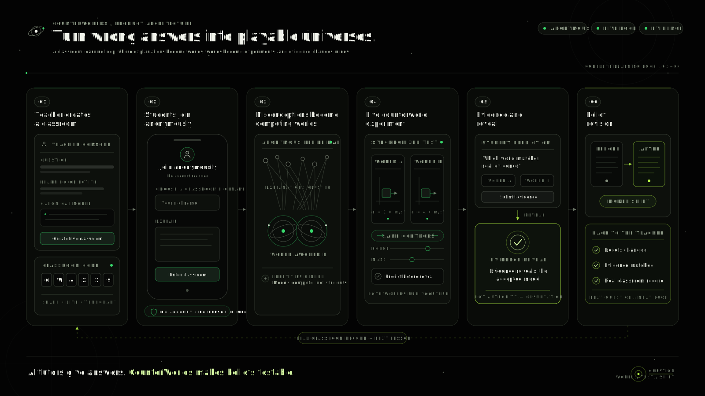
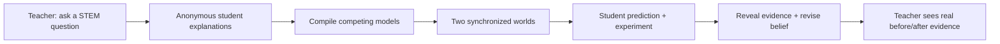
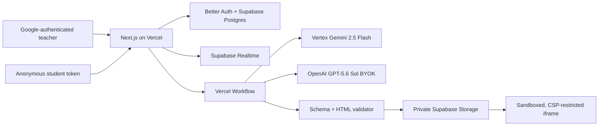

# CounterWorlds

> **Turn wrong answers into playable universes.**

CounterWorlds is a live classroom platform for grades 9–12. Instead of immediately correcting a misconception, it turns the class’s competing mental models into a neutral split-screen experiment:

- **World A** obeys the dominant misconception.
- **World B** obeys the teacher’s canonical STEM model.
- Students predict, manipulate identical controls, inspect evidence, then revise their explanation.

The result is not a conventional answer bot or misconception dashboard. It makes a belief testable before revealing which model matches the evidence.

Built for the [OpenAI Codex Hackathon](https://openai.devpost.com/).

## Why it matters

Students often hold coherent but incorrect models: “heavier objects accelerate faster,” “adding (h) shifts a graph right,” or “a catalyst changes equilibrium yield.” Those are useful starting points for inquiry, not just wrong answers to mark.

CounterWorlds preserves productive struggle. A teacher sees which models changed after evidence, while students stay anonymous and own their revision process.

## Product flow



The diagram above shows the complete classroom loop: a teacher creates a real session, anonymous students explain their thinking, competing mental models become synchronized worlds, and evidence drives a measurable belief revision.



### Teacher

1. Sign in with Google and create a school workspace.
2. Complete school-authority and 13+ onboarding.
3. Create a classroom question, learning objective, and canonical model.
4. Watch anonymous explanations arrive in real time.
5. Compile the CounterWorld and review misconception clusters.
6. Reveal the evidence after students experiment and inspect belief revisions.

### Student

1. Join using a classroom code—no account or email is required.
2. Choose a screened nickname and accept the student privacy notice.
3. Explain their initial thinking before seeing a world.
4. Predict, experiment, record evidence, and revise their explanation.

## What is real, and what is deliberately absent

This is a real-data school-pilot build.

- Classroom records, student explanations, predictions, revisions, and teacher metrics are persisted in Supabase.
- Production does **not** seed classrooms, sample students, fabricated analytics, cached fallback worlds, or synthetic success states.
- A generation failure stays visible to the teacher. It never substitutes an unrelated example world.
- Test fixtures belong only in automated tests. To see the product locally, create a real teacher workspace and a real classroom, then join from a separate browser profile.

## Architecture



| Layer | Choice | Why |
| --- | --- | --- |
| App | Next.js + TypeScript + Vercel | Responsive teacher and student journeys with server-side authorization. |
| Identity | Better Auth + Google OAuth | Teachers retain access across browsers; students stay anonymous. |
| Data | Supabase Postgres, Realtime, Storage | Real-time classroom state, durable records, and private world artifacts. |
| Default generation | Vertex AI Gemini 2.5 Flash | Platform-funded structured generation. |
| Optional OpenAI generation | GPT-5.6 Sol through the Responses API | Teacher/workspace-controlled OpenAI BYOK route with schema-constrained output. |
| Durable execution | Vercel Workflows | Retryable generation steps independent of a developer laptop. |
| Local development path | Codex SDK + `gpt-5.6-sol` | Explicit developer-only compiler path for working with Codex locally. |

## GPT-5.6 Sol and Codex

CounterWorlds uses OpenAI in two distinct, intentional ways.

### Runtime GPT-5.6 Sol route

Teachers can explicitly choose an encrypted personal or workspace OpenAI key. The workflow then calls the official OpenAI SDK’s Responses API with the fixed `gpt-5.6-sol` model and Zod-constrained output. GPT-5.6 Sol returns:

- a `WorldManifest` with misconception clusters, laws, controls, evidence, reveal, and reflection prompts;
- a self-contained interactive `world.html`; and
- an alias mapping that must account for every real student response exactly once.

Student text is serialized as untrusted data, not instructions. Generated output is validated before publication: no network calls, external assets, browser storage, popups, navigation, dynamic evaluation, or parent-frame access are allowed. The final experiment is rendered in a sandboxed iframe with restrictive CSP.

The platform default remains Vertex Gemini 2.5 Flash. CounterWorlds never silently switches providers after an error; the teacher sees the failure and chooses whether to retry or change provider. See the [GPT-5.6 Sol model documentation](https://developers.openai.com/api/docs/models/gpt-5.6-sol).

### How we collaborated with Codex

Codex was a hands-on development collaborator throughout this build—not a post-hoc code generator.

| Phase | How Codex accelerated the work | Key decision it helped implement |
| --- | --- | --- |
| Product shaping | Turned the core learning thesis into concrete teacher/student flows and a two-minute demo story. | Wrong mental models become manipulable worlds rather than answer-key mistakes. |
| AI contract | Helped define the structured world manifest, prompt-injection boundary, validation rules, and testable generation stages. | The model can create an experiment only inside a strict learning and browser-safety contract. |
| School-pilot foundation | Implemented the Better Auth/Google identity flow, workspace roles, anonymous student access, auditability, and lifecycle controls. | Teachers have persistent ownership; students do not need accounts or provide PII. |
| Visual system | Recreated the black, warm-white, lime/emerald observatory interface, particle landscape, custom themed selectors, and accessible states. | The experiment remains visually neutral before reveal. |
| Deployment debugging | Diagnosed the Vercel/Supabase pooler TLS issue and the Better Auth cookie-prefix redirect loop from runtime evidence. | Google sign-in now reaches onboarding for first-time teachers and the dashboard for returning teachers. |
| Verification | Ran lint/build/test loops, inspected generated-world safety boundaries, and kept secret values out of committed files and documentation. | The shipped path is based on real persistence and real provider behavior, not mock data. |

The repository retains the development-only `@openai/codex-sdk` worker in `scripts/codex-worker.ts`. It starts a Codex thread with `gpt-5.6-sol`, writes only a manifest and self-contained world to a temporary workspace, then validates both before publishing. It is disabled in production unless `ENABLE_LOCAL_CODEX_WORKER=true`; deployed generation uses Vercel Workflows instead.

## Running the project

### Prerequisites

- Node.js **22.13+**
- A Supabase project
- A Google OAuth web client
- A Vertex AI service account for the default compiler
- Vercel for workflows and production deployment
- Optional: an OpenAI API key with GPT-5.6 Sol access, only if testing the BYOK path

### 1. Install dependencies

```bash
git clone https://github.com/AdarshSingh-ASR/CounterWorlds.git
cd CounterWorlds
npm install
```

### 2. Configure environment variables

Copy the checked-in template:

```bash
copy .env.example .env.local
```

On macOS/Linux, use `cp .env.example .env.local` instead.

Set the values below. Never commit `.env.local`.

```text
# Supabase
NEXT_PUBLIC_SUPABASE_URL=
NEXT_PUBLIC_SUPABASE_PUBLISHABLE_KEY=
SUPABASE_SERVICE_ROLE_KEY=
DATABASE_URL=                         # Supabase transaction pooler URL
DATABASE_MIGRATION_URL=               # direct Postgres URL, for migrations/tools

# Better Auth + Google
COUNTERWORLDS_BASE_URL=http://localhost:3000
BETTER_AUTH_URL=http://localhost:3000
BETTER_AUTH_SECRET=
GOOGLE_CLIENT_ID=
GOOGLE_CLIENT_SECRET=

# Local Codex worker only
COUNTERWORLDS_WORKER_TOKEN=
ENABLE_LOCAL_CODEX_WORKER=false

# Vertex default provider
GOOGLE_VERTEX_CREDENTIALS=            # Base64-encoded service-account JSON
GOOGLE_CLOUD_LOCATION=global

# Server-only security
AI_CREDENTIAL_ENCRYPTION_KEY=          # Base64-encoded 32-byte key
IP_HASH_SECRET=
CRON_SECRET=
PLATFORM_ADMIN_EMAILS=
LEGAL_OPERATOR_NAME=
LEGAL_CONTACT_EMAIL=
```

Generate independent high-entropy values for `BETTER_AUTH_SECRET`, `IP_HASH_SECRET`, and `CRON_SECRET`. `AI_CREDENTIAL_ENCRYPTION_KEY` must decode to exactly 32 random bytes.

For the Google OAuth client, register:

```text
http://localhost:3000/api/auth/callback/google
https://YOUR_PRODUCTION_DOMAIN/api/auth/callback/google
```

Also add the matching origins in Google Cloud, for example `http://localhost:3000` and `https://YOUR_PRODUCTION_DOMAIN`.

### 3. Apply Supabase migrations

Link your Supabase project, then apply the checked-in migrations in order:

```bash
npx supabase login
npx supabase link --project-ref YOUR_PROJECT_REF
npx supabase db push
```

The migrations create the `better_auth` schema plus classroom, audit, credential, rate-limit, lifecycle, and generated-artifact tables. Do this before the first Google sign-in.

### 4. Run locally

```bash
npm run dev
```

Open [http://localhost:3000](http://localhost:3000), sign in with Google, complete onboarding, then create a real classroom. Use an incognito window or second browser profile to join as an anonymous student.

### 5. Optional: run the local Codex compiler

Only for an explicitly enabled local development path:

```text
ENABLE_LOCAL_CODEX_WORKER=true
COUNTERWORLDS_WORKER_TOKEN=the-same-long-random-value-used-by-the-app
```

Then, in a second terminal while the app is running:

```bash
npm run worker:codex
```

Use `npm run worker:codex -- --once` to process at most one queued job. This worker requires an authenticated local Codex environment and is intentionally not the production execution path.

### Verify before opening a PR or deploying

```bash
npm run test:unit
npm run lint
npm run build
```

## Production deployment

1. Import `AdarshSingh-ASR/CounterWorlds` into Vercel.
2. Add the required environment variables to **Preview** and **Production**. Keep service-role, OAuth, Vertex, encryption, and cron values server-only.
3. Apply Supabase migrations using a direct Postgres connection or `supabase db push`.
4. Set `BETTER_AUTH_URL` and `COUNTERWORLDS_BASE_URL` to the final HTTPS origin.
5. Add the final origin and `/api/auth/callback/google` callback URL in Google Cloud.
6. Configure `vercel.json` cron authentication with `CRON_SECRET`.
7. In Preview, exercise real Google authentication, a real student join, and real Vertex generation. Test GPT-5.6 Sol only when a valid BYOK is provided.
8. Promote the verified deployment.

## Privacy, security, and lifecycle

- Google is the only teacher sign-in/recovery method; CounterWorlds stores no teacher password.
- Students use classroom-scoped anonymous bearer tokens stored only as SHA-256 hashes.
- Student nicknames are screened for emails, phone numbers, URLs, and profanity.
- Raw IP addresses are never stored; rate-limit identifiers use an HMAC.
- Workspace admins see operational metadata, not student text or student-level mappings.
- OpenAI keys use AES-256-GCM and APIs return only scope, last four characters, and timestamps.
- Generated worlds cannot fetch resources, use storage/cookies, navigate, open popups, evaluate dynamic code, or access the parent frame.
- Explicit deletion removes classroom rows and Storage artifacts. Inactive sessions archive automatically; archived sessions purge after the configured retention window.

## Key implementation files

- `workflows/generate-counterworld.ts` — durable provider generation and structured output handling
- `scripts/codex-worker.ts` — explicit local Codex SDK development compiler
- `lib/world-validator.ts` — generated-world validation and sandbox policy
- `lib/security.ts` — nickname screening, identifier hashing, and AES-GCM
- `lib/auth.ts` — Better Auth, Google provider, workspace, admin, and TOTP configuration
- `lib/classroom-store.ts` — scoped persistence, lifecycle, and job state
- `supabase/migrations/20260720110000_school_pilot.sql` — school-pilot schema
- `tests/school-pilot.test.ts` — identity, security, and provenance tests

## Further documentation

- [OpenAI Codex Hackathon](https://openai.devpost.com/)
- [GPT-5.6 Sol](https://developers.openai.com/api/docs/models/gpt-5.6-sol)
- [Better Auth PostgreSQL adapter](https://better-auth.com/docs/adapters/postgresql)
- [Better Auth + Next.js](https://better-auth.com/docs/integrations/next)
- [Vercel Workflows](https://vercel.com/docs/workflow)
- [Vertex AI quickstart](https://docs.cloud.google.com/vertex-ai/generative-ai/docs/start/quickstart)

The legal pages are practical pilot drafts identifying Adarsh Singh as operator. Obtain qualified legal review before broad school deployment.
