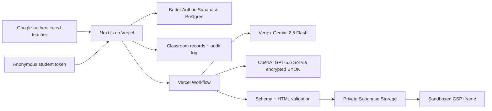

# CounterWorlds

**Turn wrong answers into playable universes.**

CounterWorlds is a real-data classroom platform for school-authorized learners aged 13+. Teachers collect short explanations, compile the class’s competing mental models into two neutral interactive worlds, and measure which beliefs change after experimentation.

The school-pilot release uses Google-only teacher identity through Better Auth, persistent school workspaces, anonymous classroom-scoped student access, Supabase persistence/private artifact storage, and durable Vercel Workflows. No production route seeds students, fabricates analytics, or substitutes a fallback world after an AI failure.

## Pilot experience

- Teachers sign in with Google, create a school workspace, complete authority/13+ onboarding, and retain classroom ownership across browsers.
- Owners/admins copy exact-email invitation links, manage roles, and can transfer classroom ownership without reading student text.
- Students enter a code, choose a screened Unicode-friendly nickname, accept the privacy notice, then complete Explain → Experiment → Revise without an account.
- Vertex Gemini 2.5 Flash is the platform-funded default. A teacher or workspace may explicitly select an encrypted OpenAI BYOK credential for GPT‑5.6 Sol.
- Generation runs as durable, retryable workflow steps. Failure remains visible and never publishes synthetic content.

## Architecture



Teacher identity always comes from the Better Auth session. Student writes use random classroom-scoped bearer tokens stored only as SHA-256 hashes. Raw IP addresses are never stored; network rate-limit identifiers use HMAC.

## Main routes

- `/sign-in`, `/onboarding`, `/dashboard`
- `/settings` and `/settings/workspace`
- `/admin` with fresh TOTP step-up
- `/join/[code]` for the anonymous student journey
- `/privacy`, `/student-privacy`, `/terms`, `/acceptable-use`

## Database setup

Use the Supabase transaction pooler for `DATABASE_URL` and a direct connection for migrations. Back up current rows, then apply migrations in timestamp order:

1. `supabase/migrations/20260718170000_counterworlds.sql`
2. `supabase/migrations/20260718193000_real_data_only.sql`
3. `supabase/migrations/20260720110000_school_pilot.sql`

The pilot migration creates Better Auth tables in the dedicated `better_auth` schema (Supabase reserves its own `auth` schema); adds profiles, workspace settings, encrypted AI credentials, immutable audits, rate limits, and MFA grants; upgrades classroom ownership/lifecycle data; hashes new membership tokens; and installs atomic database rate limiting.

## Required environment

Copy `.env.example` to `.env.local`:

```text
NEXT_PUBLIC_SUPABASE_URL=
NEXT_PUBLIC_SUPABASE_PUBLISHABLE_KEY=
SUPABASE_SERVICE_ROLE_KEY=
DATABASE_URL=
DIRECT_DATABASE_URL=

BETTER_AUTH_SECRET=
BETTER_AUTH_URL=http://localhost:3000
GOOGLE_CLIENT_ID=
GOOGLE_CLIENT_SECRET=

GOOGLE_VERTEX_CREDENTIALS=
GOOGLE_CLOUD_LOCATION=global
AI_CREDENTIAL_ENCRYPTION_KEY=
IP_HASH_SECRET=
CRON_SECRET=

PLATFORM_ADMIN_EMAILS=adarshsingh8a33@gmail.com
LEGAL_OPERATOR_NAME=Adarsh Singh
LEGAL_CONTACT_EMAIL=adarshsingh8a33@gmail.com
```

`GOOGLE_VERTEX_CREDENTIALS` is Base64 service-account JSON. `AI_CREDENTIAL_ENCRYPTION_KEY` must decode to exactly 32 random bytes. Generate independent high-entropy values for the Better Auth, IP-HMAC, and cron secrets.

Authorize both Google OAuth callbacks:

```text
http://localhost:3000/api/auth/callback/google
https://YOUR_PRODUCTION_DOMAIN/api/auth/callback/google
```

## Local development

Requires Node.js 22.13+, Supabase/PostgreSQL credentials, Google OAuth, and a Vertex service account.

```bash
npm install
npm run dev
npm run test:unit
npm run lint
npm run build
```

The Codex SDK worker remains only for explicit local development. Its API is disabled in production unless `ENABLE_LOCAL_CODEX_WORKER=true`; production generation uses Vercel Workflows.

## AI providers

Vertex uses `@google/genai`, Vertex mode, `gemini-2.5-flash`, global location, low-temperature structured output, and separately serialized untrusted student text.

OpenAI BYOK accepts only `gpt-5.6-sol`. Keys are verified and encrypted with AES-256-GCM. APIs return only scope, last four characters, and timestamps; workflow payloads, logs, audits, errors, and client bundles never receive plaintext keys.

## Security and lifecycle

- Google is the only teacher sign-in/recovery method; there are no CounterWorlds passwords.
- Invitations require Google sign-in with the exact invited address.
- Students cannot read another student’s explanation, prediction, or revision.
- Workspace admins receive operational metadata, not student text or student-level mappings.
- Generated HTML cannot fetch, use storage/cookies, navigate, open popups, evaluate dynamic code, or access the parent.
- Explicit permanent deletion requires the classroom code and removes database records plus Storage artifacts.
- Revealed sessions auto-archive after seven inactive days; other abandoned sessions after 30 days; archived sessions purge after 90 days via authenticated cron.
- Sensitive workspace, credential, lifecycle, support, ownership, ban, and revocation operations are audited.

## Vercel deployment

1. Import `AdarshSingh-ASR/CounterWorlds`.
2. add all required environment variables to Preview and Production.
3. Apply the reviewed migrations through the direct Supabase connection.
4. Exercise real Google and Vertex flows in Preview; test OpenAI only with a valid GPT‑5.6 Sol key.
5. Add the final production Google callback and set `BETTER_AUTH_URL` to the final HTTPS origin.
6. Promote the verified Preview.

Documentation: [Better Auth PostgreSQL](https://better-auth.com/docs/adapters/postgresql), [Better Auth Next.js](https://better-auth.com/docs/integrations/next), [Vercel Workflows](https://vercel.com/docs/workflow), [Vertex AI](https://docs.cloud.google.com/vertex-ai/generative-ai/docs/start/quickstart), [GPT‑5.6 Sol](https://developers.openai.com/api/docs/models/gpt-5.6-sol).

## Key implementation files

- `lib/auth.ts` — Better Auth configuration
- `lib/security.ts` — nickname guard, identifier hashing, AES-GCM
- `lib/classroom-store.ts` — scoped persistence and lifecycle
- `workflows/generate-counterworld.ts` — durable provider generation
- `lib/world-validator.ts` — experiment security boundary
- `supabase/migrations/20260720110000_school_pilot.sql` — pilot schema
- `tests/school-pilot.test.ts` — identity/security/provenance invariants

The included legal pages are practical pilot drafts identifying Adarsh Singh as operator. Obtain qualified legal review before broad school adoption.
