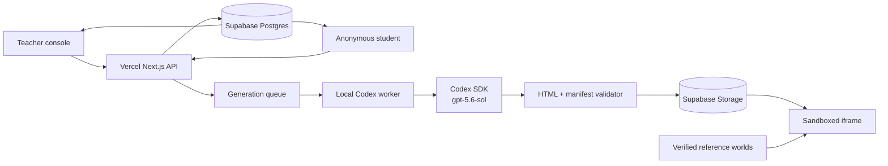

# CounterWorlds

**Turn wrong answers into playable universes.**

CounterWorlds is a live classroom experience for grades 9–12. A teacher collects short explanations, GPT-5.6 Sol clusters the class's mental models through the Codex SDK, and the system compiles a split-screen experiment: one world obeys the misconception while the other obeys the accepted model. Students predict, manipulate both worlds, gather evidence, and revise their own law before the reveal.

This repository is the runnable hackathon build for the [OpenAI Open Model Hackathon education track](https://openai.devpost.com/).

## Try the demo

1. Start the app and open `http://localhost:3000`.
2. Choose **Teacher demo**, or open `/teacher/ORBIT7`.
3. In a private/incognito window, open `/join/ORBIT7`.
4. Submit a belief, compile the CounterWorld, launch it, lock a prediction, reveal the evidence, and revise the belief.
5. Use **Reset demo** in the teacher console to restore ORBIT7.

Reference worlds:

- `/showcase/physics` — force, mass, and acceleration
- `/showcase/mathematics` — horizontal function transformations
- `/showcase/chemistry` — catalysts and equilibrium

## Architecture



The application is React 19 + TypeScript on standard Next.js and deploys to Vercel. Supabase Postgres stores classroom state and a private Supabase Storage bucket stores validated generated worlds. The classroom refresh interval is 1.8 seconds, keeping visible updates inside the two-second target.

## Supabase setup

Create a Supabase project, then apply [`supabase/migrations/20260718170000_counterworlds.sql`](supabase/migrations/20260718170000_counterworlds.sql) in the Supabase SQL Editor. The migration creates all tables, indexes, foreign keys, row-level-security boundaries, and the private `counterworlds` Storage bucket.

All tables deny direct `anon` and `authenticated` access. The Next.js API uses the service role on the server and applies teacher/student token authorization before returning data.

Copy `.env.example` to `.env.local` and configure:

```text
NEXT_PUBLIC_SUPABASE_URL=https://your-project.supabase.co
NEXT_PUBLIC_SUPABASE_PUBLISHABLE_KEY=your-publishable-key
SUPABASE_SERVICE_ROLE_KEY=your-service-role-key
COUNTERWORLDS_WORKER_TOKEN=a-long-random-secret
COUNTERWORLDS_BASE_URL=http://localhost:3000
```

Never expose or commit `SUPABASE_SERVICE_ROLE_KEY` or `COUNTERWORLDS_WORKER_TOKEN`.

## Local development

Requirements: Node.js 22.13 or newer, a configured Supabase project, and a Codex/ChatGPT sign-in that can use GPT-5.6 Sol.

```bash
npm install
npm run dev
```

The ORBIT7 classroom and its anonymized sample beliefs seed on first use.

Run checks with:

```bash
npm run test:unit
npx tsc --noEmit
npm run lint
npm run build
```

## Vercel deployment

Import `AdarshSingh-ASR/CounterWorlds` into Vercel and add these production environment variables:

- `NEXT_PUBLIC_SUPABASE_URL`
- `NEXT_PUBLIC_SUPABASE_PUBLISHABLE_KEY`
- `SUPABASE_SERVICE_ROLE_KEY`
- `COUNTERWORLDS_WORKER_TOKEN`

Vercel detects the standard Next.js build automatically. Every push to `main` produces a new production deployment.

## Live GPT-5.6 Sol generation

Run the local generation worker after setting `COUNTERWORLDS_BASE_URL` to the local or deployed site and using the same `COUNTERWORLDS_WORKER_TOKEN` configured in Vercel:

```bash
npm run worker:codex
```

[`scripts/codex-worker.ts`](scripts/codex-worker.ts) polls queued jobs and starts a Codex SDK thread with the explicit `gpt-5.6-sol` model. Student text is treated as untrusted data. Codex writes only `manifest.json` and `world.html` in a temporary workspace; the worker validates both files before uploading the artifact to private Supabase Storage. If generation fails or exceeds 90 seconds, the API atomically publishes the closest verified reference world.

## Security and privacy

- Students receive generated aliases; no name, email, account, or sensitive educational record is requested.
- Each anonymous membership receives a random bearer token. Student writes are resolved from that token rather than a client-supplied alias.
- Student reads contain only that member's response, prediction, and revision. Aggregate evidence requires the teacher token.
- The canonical explanation is withheld from student API responses until reveal.
- Supabase tables and Storage objects reject direct public access; only the server-side service role can reach them.
- Teacher tokens remain in session storage. Service-role and generation-worker secrets remain server-side.
- Student prompt injection is delimited as untrusted content in the Codex prompt.
- Generated HTML cannot use external resources, network calls, navigation, browser storage, parent-window access, or dynamic code evaluation.
- Validated worlds receive a restrictive content security policy and run inside `sandbox="allow-scripts"`.
- Three verified bundled worlds keep the judge experience functional when the local worker is offline.

The hard-coded `demo-teacher-token` is scoped only to the resettable ORBIT7 sample. New classroom teacher tokens are random.

## Key files

- [`components/CounterWorldsApp.tsx`](components/CounterWorldsApp.tsx) — teacher, student, landing, and showcase flows
- [`components/WorldLab.tsx`](components/WorldLab.tsx) — synchronized split-screen experiments
- [`lib/classroom-store.ts`](lib/classroom-store.ts) — Supabase persistence and application authorization
- [`lib/supabase-server.ts`](lib/supabase-server.ts) — server-only Supabase client
- [`lib/world-validator.ts`](lib/world-validator.ts) — generated-world security boundary
- [`scripts/codex-worker.ts`](scripts/codex-worker.ts) — Codex SDK generation worker
- [`tests/counterworlds.test.ts`](tests/counterworlds.test.ts) — schemas, clustering, validation, and adversarial inputs

## Three-minute submission video

1. **0:00–0:20 — Thesis.** “AI tutors give answers. CounterWorlds makes beliefs testable.”
2. **0:20–0:50 — Capture.** Teacher question and anonymous explanations.
3. **0:50–1:15 — Compile.** Misconception constellation and GPT-5.6 Sol/Codex stages.
4. **1:15–2:00 — Experiment.** Student predicts, changes controls, compares worlds, and sees the reveal.
5. **2:00–2:25 — Revision.** Student rewrites the law; teacher sees conceptual change.
6. **2:25–2:50 — Generality.** Physics, mathematics, and chemistry.
7. **2:50–3:00 — Close.** “Don't correct the wrong answer. Build its universe.”

## License

Hackathon prototype. Add the desired license before distributing it beyond the event.
